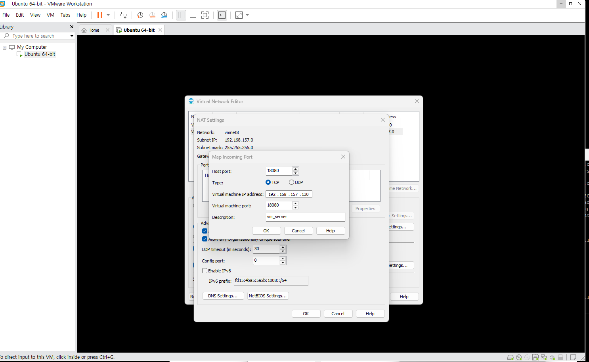
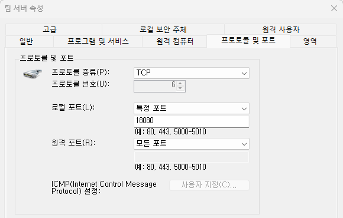
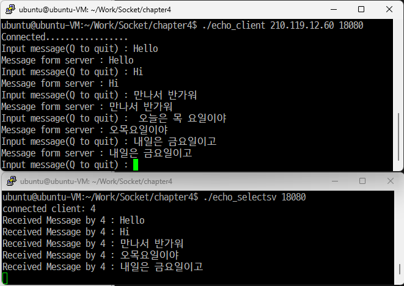
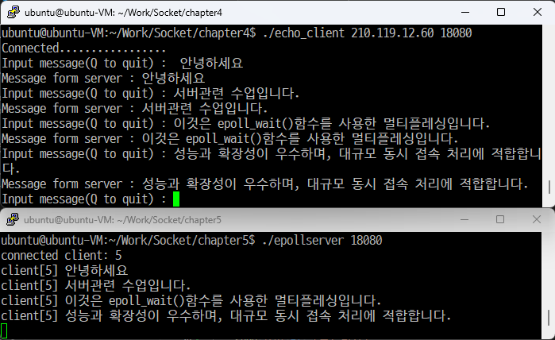
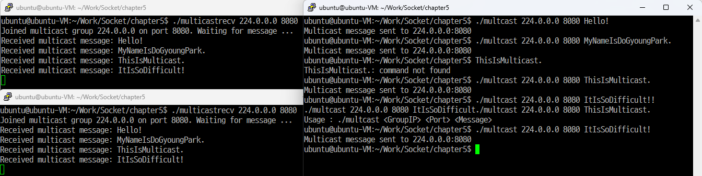
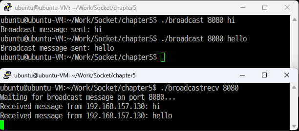

# IP-SOCKET-2025
IP/SOCKET

### Socket 통신
- 이더넷 기반 실시간 데이터 전송방식인 TCP, UDP를 상둉하는 양방향 통신
- 데이터를 요청하는 클라이언트, 데이터 제공하는 서버 주체 필요
- **네트워크** (Net + Work)합성어 두 대의 기기를 연결하고 서로 통신할 수 있는 것
- **소켓** - 전송 계층과 응용 프로그램 사이의 인터페이스 역할을 하며 떨어져 있는 두 호스트를 연결
- **IP** - 데이터를 정해진 목적지까지 전달만 하는 역할, 비신뢰성, 비연결성의 특징 가짐
    -> 온전한 데이터의 전달 보장 X
- **프로토콜** - 컴퓨터 간 원거리 통신 장비 사이에서 메시지를 주고 받는 양식과 규칙의 체계
- **TCP** - 데이터를 온전하게 받을 수 있도록 도와주는 프로토콜
- **HTTP** - 웹 브라우저와 웹 서버 간에 데이터를 주고 받기 위한 프로토콜

#### 서버
|함수|설명|예시|
|----------|----------|------|
|socket()|소켓생성|전화기 구입|
|bind()|소켓 주소 할당|전화번호 할당|
|listen()|연결 요청 대기|개통|
|accept()|연결 허용|전화 받기|
|read()/write()|데이터 송수신|통화|
|close()|연결 종료|통화 종료|

#### 클라이언트
|함수|설명|예시|
|----------|----------|------|
|socket()|소켓생성|전화기 구입|
|connect()|연결요청|전화 걸기|
|read()/write()|데이터 송수신|통화|
|close()|연결 종료|통화 종료|


#### main 인자
```C
#include <stdio.h>
main(int argc, char *argv[]){
    int i = 0;
    printf("인자개수 : %d\n", argc);
    printf("프로그램 파일 : %s\n", argv[0]);
    for(i = 1; i < argc; i++){
        printf("추가된 인자 : %s\n", argv[i]);
    }
    return 0;
}
```
- 실행 파일 뒤에 문자열을 입력하고 엔터, 인자를 추가할 시에는 한 칸 띄우고 입력
- 실행 시 argv[0]에는 위치 경로와 파일명이 들어가고, argv[1]부터 출력할 내용이 저장되어 출력됨
    -> 2개의 인자 가짐

#### IP(Internet Address)
- 인터넷상에서 컴퓨터를 구분하는 목적으로 사용되는 주소
- IPv4(4바이트 주소 체계), IPv6(6바이트 주소 체계)
- IPv4 (네트워크 주소/호스트 주소로 나뉨)
    - 클래스 A : 첫번째 비트는 항상 0
    - 클래스 B : 첫 두 비트는 항상 10(128)
    - 클래스 C : 첫 세 비트는 항상 110(192)

#### 프로토콜계(Protocol Family)
|이름|체계|
|---|----|
|PF_INET|IPv4 인터넷 프로토콜체계|
|PF_INET6|IPv6 인터넷 프로토콜체계|
|PF_LOCAL|로켓통신을 위한 UNIX 프로토콜체계|
 
#### 프로토콜 체계 PF_INET의 대표적인 소켓 타입
- 연결 지향형 소켓 타입(SOCK_STREAM) - TCP소켓
    - 중간에 데이터가 소멸하지 않고 전송 순서대로 데이터가 수신됨
    - 데이터의 경계가 존재하지 않는 소켓의 연결이 1대1 구조
- 비 연결 지향형 소켓 타입(SOCK_DGRAM) - UDP 소켓
    - 순서 상관없는 빠른 전송을 지향하므로 데이터 손실 및 파손의 우려 있음
    - 데이터가 경계가 존재하며 한 번에 전송할 수 있는 크기가 존재


## 4일차
### IO 멀티 플레싱 (IO Multiplexing)
##### 멀티프로세서의 단점
- 프로세서의 빈번한 생성 
-> 성능저하 발생, 멀티 프로세서의 흐름 구현 어려움
- 해결책
=> 하나의 프로세서로 다수의 클라이언트에게 서비스를 제공!
=> IO 멀티 플렉싱(하나의 프로세서가 서버 소켓 + 여러 클라이언트 소켓을 관리)

- fd_set 구조체
    - fd를 관리하기 위해 디자인 된 구조체
    - fd_set 변수를 사용하는 매크로 함수

    |함수|설명|
    |----|----|
    |fd_zero(fd_set* fdset)|fdset 테이블의 모든 비트를 0으로 초기화|
    |fe_set(in fd, fd_set* fdset)|fdset테이블에 전달된 fd 등록|
    |fe_clr(int fd, fd_set* fdset)| fdset 테이블에 전달된 fd 삭제|
    |fd_isset(int fd, fd_set* fdset)| fdset 테이블에 전달된 fd의 정보가 있으면 1 반환|


#### select
- 다수의 파일 디스크립터를 등록하여 읽기/쓰기/오류에 대한 이벤트 발생 여부를 관찰

```C
#include <sys/select.h>
#include <sys/time.h>

int select(int maxfd, fd_set* readset, fd_set* writeset, fd_set* exceptset, const struct timeval* timeout);
    => 타임아웃 시 0, 변화 감시 시는 변화 감지된 파일 디스크립터 수, 실패 시 -1 반환
```
|항목|설명|
|-----------|--------------|
|maxfd|검사 대상이 되는 파일 디스크립터의 수 |
|readset |fd_set형 변수에 수신된 데이터의 존재여부에 관심있는 파일 디스크립터|
|writeset| fd_set형 변수에 블로킹 없는 데이터의 전송여부에 관심있는 파일 디스크립터|
| exceptset|fd_set형 변수에 예외상황 발생여부에 관심있는 파일 디스크립터 |
|timeout |select 함수 호출 이후에 무한정 블로킹에 빠지지 않도록 타임아웃 설정|
|반환값|타임아웃에 의한 반환 시는 0, 변화 발생시는 변화된 파일 디스크립터의 수를 반환|


```C
struct timeval {
    long tv_set;    		// seconds
    long tv_usec;			// microseconds
}
```
- Timeval구조체는 gettimeofday() 함수로 현재 시간을 구하여 저장
- 시간을 표시하기 위한 구조체


<!--  -->


방화벽 인바운드 규칙 생성 > 팀 서버 생성 > 포트 번호 지정 (TCP/18080)
    


* 서버 실행
```shell
./echo_selectsv 18080[서버포트 번호]
```

* 다른 사람의 ip 주소 서버로 접속
```shell
./echo_client [ip주소] [서버포트번호]
```

* 오류
```shell
    bind() error  // 오류 발생
    // 현재 사용중인 서버 프로세스가 있는 것!
    //------------------------
    sudo lsof -i :[포트번호]
    kill -9 프로세스명(PID) // 강제 종료
```

결과 
- 클라이언트에서 보내는 메시지 서버에서 출력
    


## 5일차
### 멀티플레싱 - poll
- select 보다 유연하고 구조체 배열로 처리 (FD 수 제한 X)

```C
#include <poll.h>
int poll(struct pollfd fds[], nfds t nfds, int timeout);

struct pollfd {
    int fd;         // file descriptor 
    short events;   // requested events (관찰할 이벤트) 
    short revents;  // returned events (실제 발생한 이벤트)
}
```
nfds : fds[]의 크기
timeout : 대기시간(-1은 무한 대기, 0은 즉시 리턴)

* 파일 디스크립터를 등록하고 감시할 이벤트 지정
* Revents에는 감시할 이벤트 중 발생한 이벤트를 저장하여 사용

|이벤트 상수 | 설명 |
|------------|-----|
|POLLIN| 읽기 이벤트 감시|
|POLLOUT| 쓰기 이벤트 감시|
|POLLERR| 에러 감지|
|POLLUP| 연결 종료 감지|

* fds[]에 server socket을 등록하고 읽기 이벤트가 발생하면 client socket 을 생성
-> client socket을 등록하고 읽기 이벤트 발생시 데이터 read


#### 멀티플레싱 - epoll
- 리눅스에서 고성능 네트워크 서버 구현에 사용되는 이벤트 기반 멀티 플레싱 서버로 성능과 확장성이 우수하며, 대규모 동시 접속 처리에 적합 (생성 -> 설정 -> 대기)

```C
    epoll_ctl(A, EPOLL_CTL_ADD, B, C); // epoll 인스턴스 A에 파일 디스크립터 B를 등록하여 C를 통해 전달된 이벤트를 관찰
```

```C
    struct epoll_event{
        uint32_t events // 감시할 이벤트
        epoll_data_t data; // fd 또는 사용자 정의 이벤트
    }
```

##### epoll_wait() 
- 관심있는 fd들에 무슨 일이 일어났는지를 조사,
사건이 일어나면 (epoll_event).events[] 리스트에 일어난 사건들을 저장.
동시 접속사수에 상관없이 maxevents 파라미터로 최대 몇 개까지의 event를 처리할 것인지 지정해주고 있음
```c
for (int i = 0; i < n; i++) {
    int fd = events[i].data.fd;					// 이벤트가 일어난 fd
        uint32_t ev = events[i].events;				// 일어난 이벤트 종류 

        if (ev & EPOLLIN) {							// 일어난 이벤트가 EPOLLIN이면
                printf("읽기 이벤트 발생: fd = %d\n", fd);
        }
}
```
* epoll 함수 사용


| 항목        | Level-Triggered                                                                 | Edge-Triggered                                                                                       |
|-------------|----------------------------------------------------------------------------------|-------------------------------------------------------------------------------------------------------|
| 이벤트 발생 | 읽을 게 있으면 **계속 이벤트를 발생**<br>데이터가 들어올 때마다 `epoll_wait()` 발생하고 읽을 때까지 알림 | 상태 변화가 있을 때만 **한 번 발생**<br>새 데이터가 처음 들어올 때 **한 번만 알림**<br>`read()`로 버퍼를 완전히 비우지 않으면 데이터 유실이 일어난다. 따라서 반드시 루프 + non-blocking 소켓 + 전체 버퍼 읽기 |
| 반복 여부   | 필요 없음                                                                       | 필요함                                                                                                |
| 복잡도     | 구현 쉬움                                                                        | 구현 복잡                                                                                              |
| 효율성     | 낮음 (CPU 사용 비효율적)                                                        | 높음 (CPU 사용 효율적)                                                                                |
| 디폴트 모드 | 기본값                                                                           | `EPOLLET` 명시 필요                                                                                   |
| 버퍼        | 다음 `epoll_wait()`에서도 또 알림                                               | 알림 없음 → 데이터 유실 가능                                                                          |
| 예시        | `Events = EPOLLIN`<br>`epoll_ctl(epfd, EPOLL_CTL_ADD, fd, &ev);`               | `Events = EPOLLINㅣEPOLLET`<br>`epoll_ctl(epfd, EPOLL_CTL_ADD, fd, &ev);`                               |


### UDP
- 흐름제어가 없음
- 서버와 클라이언트가 연결되어 있지 않음
- 데이터 입출력 함수(sendto, recvfrom)
    - sendto 함수 호출 이전에 ip와 port가 할당되어야 함 (자동 할당)
```C
매번 호출 시 주소 정보를 저장한다.
#include <sys/socket.h>

ssiz_t sendto(int sock, void *buf, size_t nbytes, int flags, struct sockaddr *to, socklent_t addrlen);
    ⇒ 성공 시 전송 바이트 수, 실패 시 -1 반환
    
ssiz_t recvfrom(int sock, void *buf, size_t nbytes, int flags, struct sockaddr *from, socklent_t addrlen)
    ⇒ 성공 시 수신된 바이트 수, 실패 시 -1 반환
```
|항목|설명|
|---|---|
|sock|		UDP소켓 파일디스크립터|
|buf|			전송할 버퍼의 주소값|
|nbytes|		전송할 데이터 크기|
|flags|		옵션. 없으면 0|
|to|			목적지 주소정보를 가지고 있는 sockaddr 구조체 변수 주소값|
|addrlen|		목적지 주소정보의 크기|


- 기본적으로 unconnected UDP 소켓
- connected UDP 소켓을 생성하려면 connect 함수를 호출하면 됨


(p.51)
### UDP 기반 멀티캐스트 & 브로드캐스트
- 네트워크에서 한 송신자가 데이터를 한 번에 여러 장치에서 전송할 때 사용되는 방식
- 멀티캐스트
    - 특정 멀티캐스트 그룹을 대상으로 데이터 딱 한 번 전송
    - 그룹에 속하는 클라이언트는 모두 데이터 수신

- 브로드캐스트
    - 동일한 네트워크 내에 존재하는 호스트에게 데이터 전송
    - 데이터 전송의 대상이 호스트가 아닌 네트워크

* 같은 네트워크에 있는 모든 장치에게 알림	 ⇒  브로드캐스트(DHCP 요청 등)
* 같은 서비스를 구독 중인 장치들에게 만 전달	 ⇒ 멀티캐스트(IPTV, 실시같스트리밍, 게임, 모니터링)
* 하나의 대상에게만 전달					 ⇒ 유니캐스트


(p.52)
#### 멀티캐스트
- 1 대 N 통신
- 수신을 확인하지 않는 UDP 방식 사용(연결 개념 X)
- 224.0.0.0 ~ 239.255.255.255 의 범위에서 설정
- TTL(Time to Live)이라는 필드를 가지며 라우터를 지날때마다 TTL값이 1씩 감소함
- TTL은 0이 되면 더 이상 출력되지 않음


* 그룹에 가입하는 방법 (수신자)
```c
Struct  ip_mreq  mreq;
mreq_adr.imr_multiaddr.s_addr = inet_addr(“멀티캐스트 그룹 IP”);
mreq_adr.imr_interface.s_addr = htonl(INADDR_ANY);
seosockopt(recv_sock, IPPROTO_IP, IP_ADD_MEMBERSHIP, (void*)&mreq_adr, sizeof(mreq_adr));
IP프로토콜의 IP_ADD_MEMBERSHIP옵션을 사용한다.
```

* 그룹정보를 저장하는 ip_mreq 구조체
```C
Struct ip_mreq {
    struct  in_addr  imr_multiaddr;
    struct  in_addr  imr_interface;
}
```

* sender는 그룹주소로 전송만 하고 Receiver는 그룹에 가입하는 코드가 추가되어야 함


1. 패킷의 무한 루프 방지
    - 네트워크에 라우팅 설정 오류 등으로 인해 루프 구간이 생길 경우, 패킷이 해당 구간에 맴돌며 네트워크 전체 마비 우려 있음
    => TTL은 패킷이 라우터를 하나 거칠때마다 1씩 감소하고 0이 되면 해당 패킷을 소멸하여 무한정 네트워크에 남아있지 않게 안정성 보장

2. 멀티캐스트 전송 범위 제어
    - 브로드캐스트는 기본적으로 아우터를 통과하지 못하고 하나의 로컬 내에서만 전파됨
    - 멀티캐스트는 라우터를 통과하여 여러 다른 네트워크를 전송될 수 있게 설계됨 -> 아무런 제약이 없을 경우 전 세계 인터넷망으로 퍼져 트래픽 유발 가능성 있음
    => TTL은 이 멀티캐스트 패킷이 얼마나 멀리 퍼져 나갈지를 제어하는 핵심 수단
    TTL = 1 로컬 네트워크 내
    TTL = 16 캠퍼스, 특정 기관 내부 네트워크 정도의 범위
    TTL = 64 지역(Region)단위의 네트워크 범위
    TTL = 128 전 세계적인 범위


* 멀티캐스트 전송 결과
    
    - 두 군데 전송 가능
    - 한 번 전송 후 다시 연결 후 에 전송해야 함!


#### 브로드캐스트
- 같은 서브넷의 모든 호스트를 대상으로 함
- IP주소가 255.255.255.255 또는 서브넷 브로드캐스트
- 라우터를 통과하지 못해 로컬에서만 유효함
- 전송자 옵션
```C
int flag = 1;
setsocket(sock, SOL_SOCKET, SO_BROADCAST, &flag, sizeof(flaf):
```
|항목|설명|
|----|----|
|SO_BROADCAST|브로드캐스트 전송 허용|
|Flag|1로 설정하면 255.255.255.255 같은 브로드캐스트 주소로 UDP 전송 가능
이 설정이 없으면 sendto()전송 시 permission 오류 발생|


* 브로드캐스트 전송 결과
    
 - 수신자 먼저 오픈 > 송신자 메시지 전송


##### 유니캐스트 VS 애니캐스트
|항목|유니캐스(Unicast)|애니캐스트(Anycast)|
|------|------|------|
|전송대상|1:1|1:N|
|동작 방식|송신자가 특정 수신자 IP를 지정|여러 수신자 중 라우팅과 가장 가까운 수신자|
|사용 목적|일반적인 인터넷 통신|로드밸런싱, DNS 서버, CDN 등|
|라우팅 방식|고정된 IP로 직접 전달|라우터가 가장 가까운 노드 자동 선택|

## 6일차
### 스레드
- 프로세스 내에서 실제로 작업을 수행하는 최소 단위
- 프로세스 안의 자원 활용 - (별도의 영역 가짐 -> stack 생성/코드, 힙, 데이터는 공유)
- 장점
    1. 성능 향상 (병렬 처리 가능)
    2. 자원 공유 용이 (메모리 공유)
    3. 빠른 생성/종료 (프로세스보다 가벼움)
- 단점
    1. 동기화 문제 발생 (데이터 충돌)
        -> Mutex, Semaphore, Lock 동기화 도구 사용
    2. 디버깅 어려움


```C

```
sleep(10); 주석 처리시
-> 스레드 실행 X 


thread4.c
스레드 1의 연산결과를 저장하기 전에 
스레드 2가 num에 접근해 연산을 시행함!!!
=> 0이 나오지 않음
-> 연산결과를 저장한 다음에 스레드 2가 연산을 시작하고 해야 정상적인 동작 가능!!
=> num에 접근할 수 있는 키 부여, 키를 부여한 스레드만 접근할 수 있도록 함(**동기화**-접근 순서를 만든것)

#### 동기화(자원 접근 제어)
- Mutex(Mutual Exclusion)
    - 오직 하나의 스레드만 자원을 사용할 수 있도록 잠금을 거는 방식
    -> 스레드 간 충돌 막음
- Semaphore
    - 일정 개수만큼의 스레드가 자원을 사용할 수 있게 허용
    -> 제한된 수의 자원을 여러 스레드가 나눠 쓰게 조절

- 세마포어 필요 이유
    - accu()스레드가 num을 사용하기 전에 아직 입력이 안 되었을 수도 있음 -> 쓰레기 값 사용 위험
    - read()가 새로운 num을 입력할 때 accu()가 아직 안 읽었으면 덮어쓰기 문제
    => 순서를 제어해 문제 해결해줌


```C
#include <semaphore.h>

int sem_init(sem_t *sem, int pshared, unsigned int value);

// ---------- 예제
sem_t sem_one;
sem_init(&sem_one, 0, 1);  // 스레드 간 공유, 초기 자원 1개

sem_destroy(&sem_one); // 메모리 누수를 막기 위해 해제 해야 함

```

- sem : 초기화할 세마포어 변수의 주소 (ex &sem_one)
- pshared : 0이면 스레드 간 공유, 0이 아니면 프로세스 간 공유
    - 0 : 같은 프로레스의 스레드기리 공유할 때 사용
    - 1 : 다른 프로세스끼리 공유
- value : 세마포어의 초기 값(즉, 자원의 개수)
    - 0 : 대기 상태로 시작(자원이 없음)
    - 1 : 바이너리 세마포어처럼 사용(뮤텍스처럼)
    - N : 자원이 N개 있는 카운팅 세마포어

- 예제 해석
    - sem_one : 1개의 자원을 가진 세마포어
    - sem_wait(&sem_one) : 첫번째 스레드는 통과, 두번째 스레드는 첫번째가 sem_post()하기 전까지 대기


#### 코딩테스트
webpage 배열을 전송하는 웹서버를 구현하시오
    - 클라이언트 인터넷 브라우저로 서버 접속 -> HTTP request 형식의 메시지로 서버에 전달
        => GET/POST 요청 방식에 따른 서버 동작
```C
    char webpage[] = {
    "HTTP/1.1 200 OK\r\n",
    "Server:Linux Web Server\r\n",
    "Content-Type: text/html; charset=UTF-8\r\n",
    "\r\n",
    "<!DOCTYPE html>\r\n",
    "<html><head><title>My Web Page</title>\r\n",
    "<style>body{background-color: #FFF000 } </style></head>\r\n",
    "<body><center><h1>Hello World!</h1><br>\r\n",
    "</center></body></html>\r\n"
    };
```


- 전체 동작 흐름
1. 서버 시작 : 소켓 생성 -> 주소 바인딩 -> 리슨 상태
2. 클라이언트 연결 : 브라우저가 http://localhost:9090 접속
3. 요청 수신 : 클라이언트의 http 요청 받기
4. 요청 분석 
    - `GET /`  -> HTML 페이지 전송
    - `GET /Dog.jpg` -> 이미지 파일 전송
5. 응답 전송 : 해당하는 데이터 전송
6. 연결 종료 : 응답 완료 후 연결 종료
7. 반복 : 다음 클라이언트 연결 대기

- 중요 개념
1. TCP 3-way Handshake
    - 서버의 accept()와 클라이언트의 connect() 사이에 일어나는 연결 과정
2. 바이너리 vs 텍스트 전송
    - HTML : 텍스트로 전송
    - 이미지 : 바이너리로 전송(Content-Type:image/jpeg)